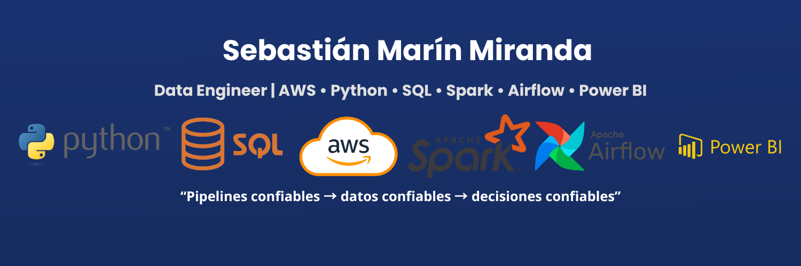

<!-- Banner -->

  

# 👋 Hola, soy Sebastián Marín — Data Engineer (AWS | Python | SQL | Spark)

Soy Data Engineer con experiencia en construcción de **pipelines de datos**, automatización en AWS y análisis de KPIs.  
Mi meta 2025: **convertirme en Senior Data Engineer Bilingüe**.

---

## ⚡ Tecnologías principales

---

## 🚀 Proyectos destacados
- **aws-datalake-energy** → Data Lake en AWS (S3 raw/processed/curated, Glue ETL, Athena, Redshift, Lake Formation, IaC).  
- **etl-python-sqlserver** → ETL en Python desde CSV/XLSX a SQL Server con validaciones.  
- **ivr_analytics** → Análisis IVR con Pandas + Power BI.  
- **booking-scraper** → Scraper de disponibilidad hotelera cerca de aeropuertos.  

---

## 📊 Estadísticas

---

## 📫 Contacto

---

> *“Pipelines confiables → datos confiables → decisiones confiables.”*

---

  
<b>EN — About me (click to expand)</b>

# Sebastián Marín — Data Engineer (AWS | Python | SQL | Spark)

I build reliable data pipelines and analytics on AWS (Glue, EMR, S3, Redshift, Athena, Lake Formation).  
2025 goal: become a **Senior, bilingual Data Engineer**.

## ⚙️ Core Tech
Python · SQL · PySpark · Airflow · Kafka · AWS (S3, Glue, EMR, Redshift, Athena, Lake Formation) · Terraform · Power BI

## 🚀 Featured Projects
- **aws-datalake-energy** — Data Lake on AWS (S3 raw/processed/curated, Glue ETL, Athena, Redshift, Lake Formation, IaC).
- **etl-python-sqlserver** — Python ETL from CSV/XLSX to SQL Server.
- **ivr_analytics** — IVR analytics with Pandas + Power BI.
- **booking-scraper** — Airport-area hotel availability scraper.

## 📫 Contact
- LinkedIn: [Sebastián Marín](www.linkedin.com/in/sebastian-marin-data-engineer)
- Email: engineer.sebastianmarin@gmail.com

